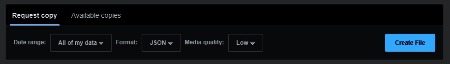
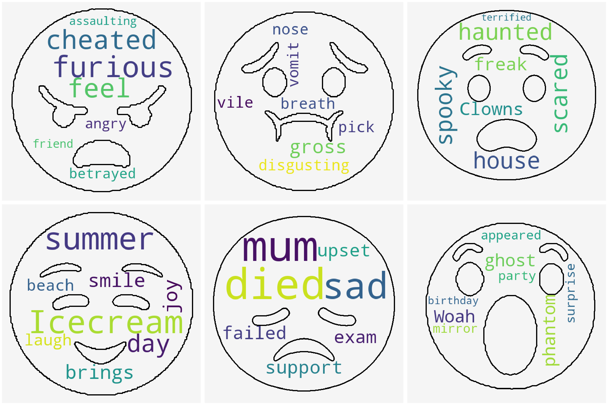

# Facebook Emotions

Download your messages

Choose a friend

And reveal all emotions end-to-end


# Setup

Download the zip file of your data from [here](https://www.facebook.com/dyi?referrer=ayi).

You need to tick the message checkbox.


Then you need to set the format to JSON and create a file.


It may take a few hours for Facebook to process your request.

Once your zip file has downloaded:
* Clone the repository
* Install the requirements
* Unzip your data into the repository

# Usage

## Fake Data

Before running the code on your own data,
 you can check everything is working on the fake data.

```
>>> python src/main.py -p fake_data -f johnsmith
```

This should create the following image in `FacebookEmotions/word_clouds.png`



### Your Data

If this ran successfully, you can run the code on your own data.

```
>>> python src/main.py -p PATH -f FRIEND -l LIMIT
```
where
* PATH is the path to your unzipped Facebook data.
* FRIEND is the full name of a friend (I.e. Johnsmith).
* LIMIT is the maximum number of message to process.
On my machine, 1000 messages can be processed in about a minute.

# Explanation

This project is based on the Ekman model found in 
https://github.com/monologg/GoEmotions-pytorch.

It can be found in Hugging Face under "monologg/bert-base-cased-goemotions-ekman".

I could not find any other good models that included the 'neutral' emotion,
so please get in touch if you find something more appropriate!

# Possible improvements

* Create our own transformer model with greater accuracy.
* Distill the model so that it can perform inference faster.


